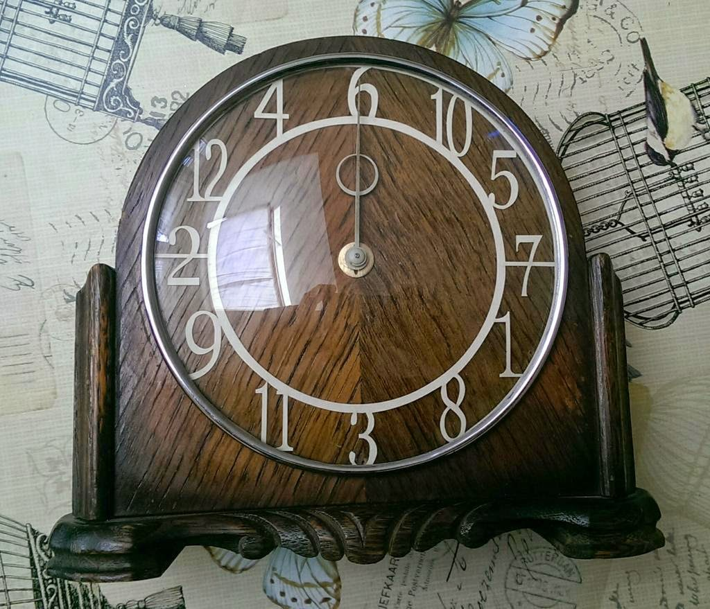
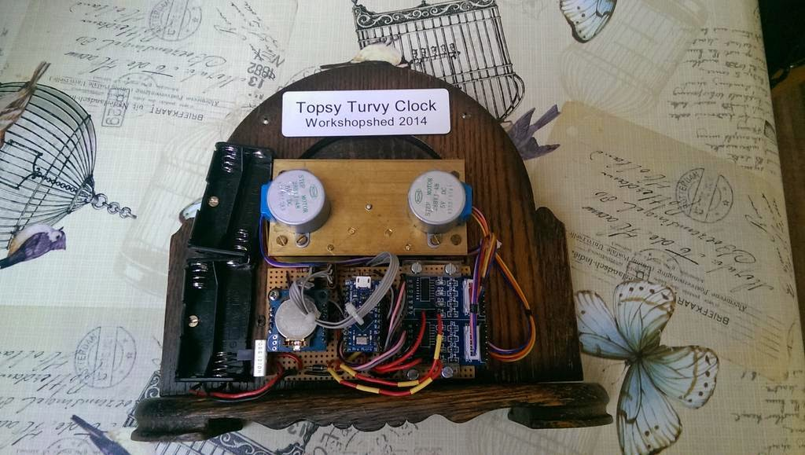

TopsyTurvyClock
===============

The Topsy Turvy Clock has the numbers in the wrong place by still tells the right time. It's powered by an Arduino Micro Pro clone, some driver chips and a DS1037 real time clock.

 

The stepper motor class provides the interface to the motor and optosensors modified CustomStepper class from Igor Campos.

The clock class encapsulates the RTC and TimeZone classes with methods to set the time and date. 

The controller class glues everything together and provides the UI in the form of serial commands. The code uses the String object's abilities to parse the commands.

Setup and loop don't have much to do, simply repeatedly calling the controller's run method.

]

Instructions
------------
The clock time and date can be set using the serial port.

Commands:

* ? - Instructions
* H - Home and stop
* Thh:mm - Set time
* Ddd/mm/yyyy - Set date
* R - Run
* S - Stop

Thanks to
---------

CustomStepper class by Igor Campos

TimeZone class by Jack Christensen

Time by Michael Margolis

DS1307 based on work by DFRobot and Michael Margolis
